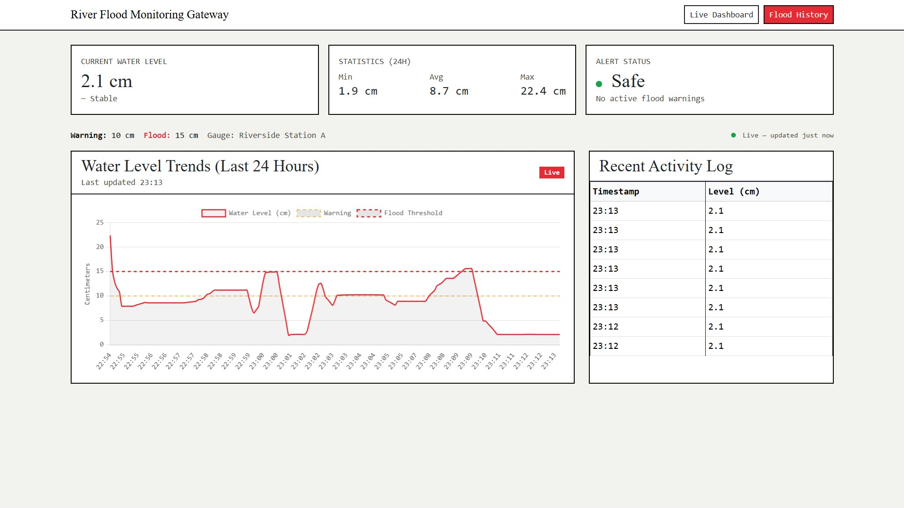

# River Flood Detection System

A real-time flood monitoring and alerting system using LoRa technology for remote water level sensing and early warning.




## Overview

This system provides **distributed river monitoring** with minimal power consumption and long-range communication:

- **ESP32-S3 Sensor Node**: Measures water level with ultrasonic sensor (HC-SR04), triggers local buzzer alarm, transmits via LoRa @ 433 MHz
- **Raspberry Pi Gateway**: Headless daemon that receives LoRa packets, filters readings with moving average, detects rapid-rise conditions, and logs to SQLite
- **Flask Dashboard**: Real-time web interface to view current water levels, flood history, and event severity

The system implements **batch-window flood confirmation** (requires 90% of 5-reading average to exceed threshold) and **rapid-rise detection** (>2 cm/min) to minimize false positives.

---

## Hardware Requirements

### Sensor Node (ESP32-S3)
- **Edgehax ESP32-S3-WROOM-N16R8** (or compatible ESP32-S3 dev board)
- **HC-SR04** ultrasonic distance sensor
- **Ra-02 LoRa Module** (SX1278 @ 433 MHz)
- **Active piezo buzzer**
- USB-C power or 3.3V regulated supply

### Gateway (Raspberry Pi)
- **Raspberry Pi Zero 2 W** (or any Pi with SPI)
- **Ra-02 LoRa Module** (SX1278 @ 433 MHz)
- SD card, USB power adapter

**LoRa Parameters** (must match on both sides):
- **Frequency**: 433 MHz
- **Spreading Factor**: 7
- **Bandwidth**: 125 kHz
- **Coding Rate**: 4/5
- **Sync Word**: 0xB4 (unique to this project)

---

## Project Structure

```
.
├── src/
│   ├── sensor/
│   │   ├── main.cpp           # ESP32-S3 firmware (batch averaging, alarm logic)
│   │   └── platformio.ini     # PlatformIO configuration
│   ├── gateway/
│   │   ├── receiver.py        # Original LoRa gateway daemon
│   │   ├── receiver_v2.py     # Updated daemon (flexible DB path resolution)
│   │   ├── requirements.txt   # Python dependencies
│   │   └── .env               # Optional: SMS alerts, simulation mode, IRQ config
│   └── dashboard/
│       ├── app.py             # Flask web application
│       ├── templates/         # HTML templates (dashboard, flood history)
│       └── instance/          # SQLite database (flood_detection.db)
├── docs/                      # Research papers, pinout diagrams, documentation
├── assets/                    # Component photos, schematics
└── archive/                   # Legacy versions
```

---

## Installation & Setup

### 1. Sensor Node (ESP32-S3)

**Install PlatformIO** (if not already installed):
```bash
pip install platformio
```

**Navigate to sensor directory and upload firmware**:
```bash
cd src/sensor
pio run -t upload -e esp32s3
```

Monitor serial output at 115200 baud:
```bash
pio device monitor -b 115200
```

**Expected serial output** (every 5 seconds):
```
Collecting reading 1/5: 12.3 cm
Collecting reading 2/5: 12.5 cm
Collecting reading 3/5: 12.4 cm
Collecting reading 4/5: 12.6 cm
Collecting reading 5/5: 12.2 cm
Batch Average: 12.4 cm | Status: NORMAL
[LoRa TX] Packet sent
```

### 2. Gateway (Raspberry Pi)

**Install Python dependencies**:
```bash
cd src/gateway
pip3 install -r requirements.txt
```

**Optional: Configure environment variables** (for SMS alerts, simulation mode, GPIO troubleshooting):
```bash
# Edit .env in the gateway directory
nano .env
```

Available variables:
- `LORA_SIMULATION_MODE=1` – Generate synthetic data (debug without hardware)
- `LORA_DISABLE_IRQ=1` – Force SPI polling instead of GPIO edge-detect (fixes most wiring issues)
- `FLOOD_DB_PATH=/custom/path/flood_detection.db` – Override database location
- `TWILIO_ACCOUNT_SID`, `TWILIO_AUTH_TOKEN`, `TWILIO_PHONE_FROM`, `TWILIO_PHONE_TO` – SMS alerts

**Start the gateway daemon**:
```bash
python3 receiver_v2.py
```

Expected startup output:
```
[STARTUP] LoRa Gateway initialized (433 MHz, SF7, BW 125 kHz)
[STARTUP] Database path: /path/to/flood_detection.db
[STARTUP] Listening for LoRa packets...
```

When packets arrive:
```
[RX] Packet from node | Raw: 12.3 cm | Filtered: 12.35 cm | Status: NORMAL
[DB] Water level logged | ID: 42
```

### 3. Dashboard (Flask)

**Start the Flask app** (in a separate terminal, after gateway is running):
```bash
cd src/dashboard
python3 app.py
```

Access the dashboard at `http://<pi-ip>:5000`

**Dashboard features**:
- **Live water level chart** (real-time updates)
- **Current status indicator** (NORMAL / WARNING / FLOOD)
- **Flood history** with event details (start time, peak, duration)
- **Alert log** with timestamp and severity
- **Manual simulation mode** (add synthetic readings for testing)

---

## Key Features

### Sensor Node (ESP32-S3)
- **Batch-window averaging**: Collects 5 readings (one every 5 seconds), averages after completion
- **Alarm logic**: Buzzer triggers if batch average ≥ threshold, stops below threshold
- **Robust filtering**: Single spike cannot trigger alarm; requires sustained high water
- **LoRa transmission**: Sends filtered average immediately after batch completion

### Gateway (Raspberry Pi)
- **Moving average filter**: 5-sample sliding window on raw readings
- **Flood confirmation window**: 2-minute sustained elevation (90% of readings above threshold) confirms flood event
- **Rapid-rise detection**: Alerts if water rises >2 cm/min (possible dam failure / extreme weather)
- **Headless operation**: No Flask, no HTTP bindings; pure data aggregation and DB writes
- **Flexible database paths**: `receiver_v2.py` auto-detects dashboard DB location
- **Simulation mode**: `LORA_SIMULATION_MODE=1` for testing without LoRa hardware
- **GPIO fallback**: `LORA_DISABLE_IRQ=1` uses SPI polling if edge-detect interrupt fails

### Dashboard (Flask)
- **Real-time visualization**: Chart updates as gateway logs readings
- **Flood event timeline**: View past events with peak water level and duration
- **Alert filtering**: See critical alerts vs. normal readings
- **Manual data entry**: Add test readings for demo purposes
- **SQLite backend**: Persistent storage, lightweight for Pi

---

## Packet Format

**Sensor → Gateway** (LoRa packet):
```
DATA:<water_level_cm>
Example: DATA:12.3
```

**Gateway Processing**:
1. Parse raw value (12.3 cm)
2. Apply 5-sample moving average filter
3. Slot into batch window (5 readings per batch)
4. When batch fills: calculate average, determine status (NORMAL/WARNING/FLOOD)
5. Write to database and emit logs

---

## Threshold Configuration

Edit thresholds in **app.py** and **receiver_v2.py** to match your river:

**For bucket demo** (small-scale testing):
```python
FLOOD_THRESHOLD   = 15.0   # cm
WARNING_THRESHOLD = 10.0   # cm
```

**For real river deployment** (8 m / 6.8 m):
```python
FLOOD_THRESHOLD   = 800.0  # 8 m in cm
WARNING_THRESHOLD = 680.0  # 6.8 m in cm
```

Thresholds must be **identical** in both `app.py` (dashboard) and `receiver_v2.py` (gateway).

---

## Wiring Reference

### ESP32-S3 → LoRa (Ra-02)
```
ESP32-S3  →  Ra-02 (SX1278)
GPIO11    →  MOSI
GPIO12    →  SCK
GPIO13    →  MISO
GPIO10    →  CS (NSS)
GPIO14    →  RST
GPIO9     →  DIO0 (IRQ)
3.3V      →  VCC
GND       →  GND
```

### HC-SR04 (Ultrasonic)
```
ESP32-S3  →  HC-SR04
GPIO5     →  TRIG
GPIO6     →  ECHO
5V        →  VCC (or 3.3V with level shifter)
GND       →  GND
```

### Buzzer
```
ESP32-S3  →  Active Piezo Buzzer
GPIO7     →  + (positive)
GND       →  - (negative)
```

### Raspberry Pi Zero 2W → LoRa (Ra-02)
```
Pi GPIO   →  Ra-02 (SX1278)
GPIO11    →  SCK  (Pin 23)
GPIO9     →  MISO (Pin 21)
GPIO10    →  MOSI (Pin 19)
GPIO8     →  CS   (Pin 24)
GPIO25    →  RST  (Pin 22)
GPIO24    →  DIO0 (Pin 18) [IRQ]
3.3V      →  VCC  (Pin 1)
GND       →  GND  (Pin 6)
```

---

## Troubleshooting

### Gateway not receiving packets
1. Check **LoRa parameters match** exactly (frequency, SF, BW, sync word)
2. Enable **`LORA_DISABLE_IRQ=1`** in `.env` to force SPI polling (fixes 90% of wiring issues)
3. Run in **`LORA_SIMULATION_MODE=1`** to verify Flask + database are working
4. Check **physical wiring** using a multimeter (power, GND continuity)

### Dashboard shows no data
1. Verify **gateway process is running** (`ps aux | grep receiver_v2`)
2. Check **database file exists**: `ls -la src/dashboard/instance/flood_detection.db`
3. Check **database file permissions**: Must be writable by gateway process
4. Restart both gateway and Flask app

### Serial monitor shows garbage
1. Verify **baud rate is 115200**
2. Check **USB cable is good** and plugged directly (not via hub initially)
3. Try **a different USB port** on the Pi or computer

### False positive floods
- Increase **`FLOOD_THRESHOLD`** or lower the **2-minute confirmation window**
- Add **physical barriers** to prevent wind from spiking sensor

---

## Running Multiple Sensor Nodes

To monitor multiple rivers/locations:

1. **Assign unique `river_name`** to each sensor in `main.cpp`:
   ```cpp
   #define RIVER_NAME "Godavari_North_Stn1"  // Change per sensor
   ```
   Include in LoRa packet format or in gateway parsing.

2. **Update `receiver_v2.py`** to parse river names and store in database.

3. **Dashboard filters by `river_name`** column in `water_level` and `flood_event` tables.

4. **Deploy multiple LoRa gateways** per region, or use a single gateway with larger TX power.

---

## Performance & Power

### Sensor Node (ESP32-S3)
- **Power draw**: ~100 mA (active reading), ~20 mA (sleep between batches)
- **Battery life**: 10+ days on 2000 mAh @ 5V (with sleep optimization)
- **Data rate**: One packet every 25 seconds (5 readings × 5 sec each + transmission)

### Gateway (Raspberry Pi Zero 2W)
- **Power draw**: ~250 mA idle, ~400 mA active (SPI + LoRa)
- **CPU overhead**: <5% with efficient polling or IRQ-based reception
- **Storage**: ~50 KB per week per node (SQLite compression)

---

## Security Considerations

- **LoRa sync word (0xB4)** is unique to this project; not using public sync words
- **No encryption** on LoRa payload (range vs. security trade-off for open water)
- For critical infrastructure: Add **HMAC-SHA256** payload authentication
- **Flask secret key** is placeholder; change `app.secret_key` for production
- **Database file** should be read-only for dashboard, write-only for gateway (process separation)

---

## Testing Modes

### Simulation Mode (No Hardware)
```bash
export LORA_SIMULATION_MODE=1
python3 receiver_v2.py
```
Gateway generates synthetic water level data following realistic patterns.

### Manual Dashboard Entry
Use the Flask UI **"Add Manual Reading"** button to insert test data and verify alarm logic.

### Batch Mode Offline Testing
Run receiver.py with a pre-recorded CSV of readings to validate gateway logic without live sensor.

---

## Project Sponsors & Contributors

- **Dayananda Sagar College of Engineering**, Bengaluru
- River Flood Detection System — 2026
- Components verified on Edgehax ESP32-S3 and Raspberry Pi Zero 2W

---

## License

This project is provided as-is for educational and non-commercial river monitoring. Modify and deploy freely, but test thoroughly before critical use.

---

## References

- [LoRa Specification](https://lora-alliance.org/)
- [HC-SR04 Ultrasonic Datasheet](https://cdn.sparkfun.com/datasheets/Sensors/Proximity/HCSR04.pdf)
- [SX1278 LoRa Transceiver](https://www.semtech.com/uploads/documents/DS_SX1276-7-8-9_W_APP_V7.pdf)
- [ESP32-S3 Technical Reference Manual](https://www.espressif.com/sites/default/files/documentation/esp32-s3_technical_reference_manual_en.pdf)
- Flask: https://flask.palletsprojects.com/
- LoRaRF Python library: https://github.com/lewisxhe/LoRaRF_For_Raspberry
